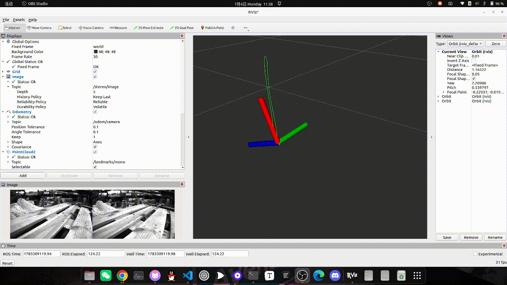
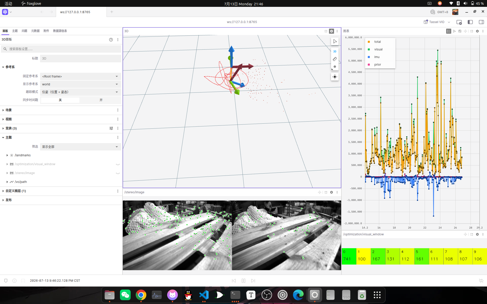

# Tassel

Tassel 是学士帽上的流苏，这寓意着这是送给作者 2027 年毕业的礼物。

## 项目框架

```text
Tassel
├── tassel_core/                 # 核心估计模块
│   ├── frond_end/              # 特征跟踪、视差判定、三角化、异常点剔除
│   ├── factor/                 # 视觉因子、IMU 因子、先验因子、预积分器
│   ├── initial/                # SFM、偏置估计、重力对齐、尺度恢复
│   ├── marg/                   # 路标块、IMU 块、平方根边缘化、先验构建
│   ├── state/                  # 滑窗状态、参数块组织与转换
│   ├── cam/                    # 相机模型与投影接口
│   ├── estimator/              # 测量输入、状态传播、优化与滑窗管理
│   └── tests/                  # 核心模块测试
├── tassel_tools/               # 配套工具模块
│   ├── parameters/             # YAML 配置读取与参数组织
│   ├── viewer/                 # ROS 2 发布与 Foxglove 可视化器
│   └── tests/                  # 工具模块测试
├── tassel_utils/               # 通用头文件工具库
├── config/                     # 估计器和可视化器配置
├── scripts/                    # 环境配置及辅助脚本
├── media/                      # 当前实现结果与演示素材
└── doc/                        # 论文与技术资料
```

## 环境配置

当前验证环境：

- Ubuntu 22.04
- GCC 11
- CMake 3.22
- ROS 2 Humble
- 系统 OpenCV 4.5.4

项目依赖：

- Eigen3
- Ceres
- Sophus
- spdlog
- yaml-cpp
- Fast CDR
- ROS 2
- cv_bridge
- TF2

仓库提供了环境配置脚本：

```bash
cd ~/Tassel

# 安装 Ubuntu/ROS 软件包，并加载当前终端环境
source scripts/setup_environment.sh --install

# 软件包已经安装时，只加载 ROS 和 CMake 环境
source scripts/setup_environment.sh
```

脚本不会自动编译 Sophus。Sophus 需要安装到 `/usr/local`、`~/.local`，或者通过
`SOPHUS_ROOT` 指定：

```bash
export SOPHUS_ROOT=$HOME/third_party/Sophus/install
source scripts/setup_environment.sh
```

OAK-D 硬件测试还需要 DepthAI C++ 和 SyncTrigger，并且对应安装前缀需要位于
`CMAKE_PREFIX_PATH` 中。只运行 EuRoC 时不需要这两个依赖。

## 编译

不使用硬件相机时：

```bash
source scripts/setup_environment.sh
cmake -S . -B build \
  -DCMAKE_BUILD_TYPE=Release \
  -DTASSEL_ENABLE_HARDWARE_TESTS=OFF
cmake --build build -j2
```

已安装 DepthAI 和 SyncTrigger 时，将 `TASSEL_ENABLE_HARDWARE_TESTS` 改为 `ON`。

## EuRoC 数据集运行

数据集目录需要包含 `mav0/cam0/data.csv`、`mav0/cam1/data.csv` 和
`mav0/imu0/data.csv`。运行命令为：

```bash
./build/tassel_core/test_euroc \
  config/euroc.yaml \
  datasets/machine_hall/MH_01_easy \
  600 \
  20
```

参数依次为配置文件、序列目录、最大处理帧数和回放帧率。最大帧数设置为 `0` 时处理
完整序列。

## 配置和启动可视化器

可视化器使用 ROS 2 `foxglove_bridge` 和 Foxglove Desktop。先安装 Foxglove Desktop，
并确认可执行文件路径与 `config/foxglove.yaml` 中的 `studio.executable` 一致。

主要配置位于 `config/foxglove.yaml`：

```yaml
bridge:
    port: 8765                       # WebSocket 端口
    address: 127.0.0.1               # 只允许本机连接
    topic_whitelist:                 # 允许桥接到 Foxglove 的 ROS 话题
        - /tf
        - /odom/camera
        - /vo/path
        - /landmarks
        - /stereo/image
        - /optimization/.*

studio:
    executable: /usr/bin/foxglove-studio
    layout_file: foxglove_layout.json
    layout_name: Tassel VIO

viewer:
    point_size: 1.75                 # 点云显示尺寸
    path_color: '#ef4444'            # 轨迹颜色
    path_line_width: 0.005           # 轨迹线宽
    cost_window_seconds: 15          # 优化曲线显示最近多少秒
```

启动可视化器：

```bash
cd ~/Tassel
source scripts/setup_environment.sh
python3 -m tassel_tools.viewer.foxglove config/foxglove.yaml
```

启动器会自动安装项目布局、启动 `foxglove_bridge` 并打开 Foxglove Desktop。修改
`config/foxglove.yaml` 后需要重启启动器，已经运行的 Bridge 不会自动更新白名单。

仅启动 Bridge 或复用已有 Bridge 时可以使用：

```bash
# 启动 Bridge，但不打开 Foxglove Desktop
python3 -m tassel_tools.viewer.foxglove config/foxglove.yaml --no-studio

# 不启动 Bridge，只打开 Foxglove Desktop 并连接已有 Bridge
python3 -m tassel_tools.viewer.foxglove config/foxglove.yaml --no-bridge
```

主要话题如下：

| 话题 | 内容 |
| --- | --- |
| `/tf` | `world -> imu` 优化姿态 |
| `/odom/camera` | 优化后的 IMU/机体里程计 |
| `/vo/path` | 最近一段优化轨迹 |
| `/landmarks` | 当前窗口路标点云 |
| `/stereo/image` | JPEG 压缩的双目特征跟踪图 |
| `/optimization/*` | 总代价、视觉、IMU、先验代价变化及视觉因子统计 |

若没有图像或曲线，先检查：

```bash
ros2 topic list
ros2 topic hz /stereo/image
ros2 topic hz /optimization/total_reduction
```

优化曲线只在后端完成一次优化时增加一个点，不会按照相机帧率更新。

## 阶段进展

| 日期 | 实现成果 | 展示 | 当前未解决问题 |
| --- | --- | --- | --- |
| 2026-06-23 | 基本完成 VIO，实现多传感器时间延迟在线估计等功能 |  | 消费级 MEMS 初始化、退化运动下的鲁棒性以及静止下的预积分器缓冲区数据累计。 |
| 2026-07-06 | 增加 EuRoC 数据集测试 |  | 静止下无法抑制速度的问题。 |
| 2026-07-13 | 增加 foxglove 可视化，以便于定位问题以及调试 |  |  |
## 参考文献

1. Li M, Mourikis A I. Online temporal calibration for camera-IMU systems: Theory and algorithms[J]. *The International Journal of Robotics Research*, 2014, 33(7): 947-964.

2. Qin T, Li P, Shen S. VINS-Mono: A robust and versatile monocular visual-inertial state estimator[J]. *IEEE Transactions on Robotics*, 2018, 34(4): 1004-1020.

3. Geneva P, Eckenhoff K, Lee W, et al. OpenVINS: A research platform for visual-inertial estimation[C]. *IEEE/RSJ International Conference on Intelligent Robots and Systems (IROS)*, 2020.

4. Usenko V, Demmel N, Schubert D, et al. Visual-inertial mapping with non-linear factor recovery[J]. *IEEE Robotics and Automation Letters*, 2020, 5(2): 422-429.

5. Dong-Si T C, Mourikis A I. Closed-form solutions for vision-aided inertial navigation[R]. University of California, Riverside, 2011.

6. Martinelli A. Observabilty properties and deterministic algorithms in visual-inertial structure from motion[R/OL]. 2014.

7. Campos C, Montiel J M M, Tardos J D. Inertial-only optimization for visual-inertial initialization[C]. *2020 IEEE International Conference on Robotics and Automation (ICRA)*, 2020.

8. Hailu H, Gebregziabher B. Motion as a sensing modality for metric scale in monocular visual-inertial odometry[EB/OL]. arXiv:2603.26740, 2026.

9. 高翔, 张涛, 刘毅, 等. 视觉 SLAM 十四讲：从理论到实践[M]. 第2版. 北京: 电子工业出版社, 2019.

10. 高翔. 自动驾驶与机器人中的 SLAM 技术：从理论到实践[M]. 北京: 电子工业出版社, 2023.

## 许可证

项目使用 [MIT License](LICENSE)。
