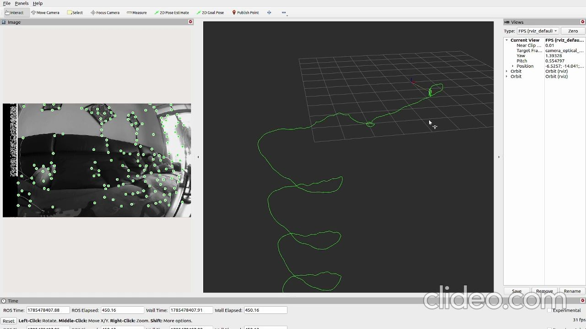

# Tassel

Tassel 是学士帽上的流苏，这寓意着这是送给作者 2027 年毕业的礼物。

[](https://www.bilibili.com/video/BV1ukGA6sEuq/?vd_source=db129daae448e5d2371829d459869e86)

[在 Bilibili 查看完整演示视频](https://www.bilibili.com/video/BV1ukGA6sEuq/?vd_source=db129daae448e5d2371829d459869e86)

## 核心特点

局部估计器主要参考 Open-VINS、VINS-Mono 和 Basalt 的相关设计。Tassel 保持独立实现，
参考项目的版权和许可证归其原作者所有。

- **在线时间延迟估计**：通过[时间延迟运动补偿模型](doc/time_delay_motion_model.md)，
  将相机-IMU 时间偏移纳入优化。
- **关键帧宿主生命周期管理**：延长以关键帧为宿主的路标生命周期，在窗口容量受限的情况下，保留局部轨迹约束。
- **选择性边缘化**：边缘化 IMU 因子及其关联的非关键帧视觉因子，避免无约束帧持续累积，降低静止状态下的速度漂移。
- **SFM 与惯性对齐初始化**：先通过[单目 SFM](doc/sfm_initialization.md)恢复无尺度
  视觉轨迹，再通过[惯性对齐](doc/inertial_alignment.md)顺序估计陀螺仪偏置、尺度、
  重力和速度。
- **自有硬件适配层**：Nori 双目惯性模组的 V4L2 采集、设备时间戳和内嵌 IMU 数据解析
  位于独立的 `tassel_hardware` 模块，不让估计器依赖设备协议或 ROS。
- **对极几何因子预留**：源码中已包含对极几何因子，后续将继续完成与当前单目初始化流程的适配。

## 当前边界

- 当前仓库只维护局部视觉惯性里程计和硬件采集适配层，回环模块已经移除。
- 动态场景、强光照变化、弱纹理和长期地图管理仍需要继续验证。

## 项目框架

```text
Tassel
├── tassel_hardware/            # 自有传感器硬件适配层
│   └── nori/                   # V4L2 采集、设备协议和时间戳/IMU 解码
├── tassel_core/                # 局部视觉惯性估计器
│   ├── frond_end/              # 单目/多相机跟踪、路标管理、三角化与离群点剔除
│   ├── factor/                 # 重投影、IMU、先验因子及预积分器
│   ├── initial/                # SFM、偏置估计、重力对齐、尺度恢复
│   ├── marg/                   # 路标与状态平方根边缘化、先验构建
│   ├── state/                  # 帧物理状态、帧类型和优化参数转换
│   ├── cam/                    # 相机模型与投影接口
│   ├── estimator/              # 单目 VIO、状态传播、优化、边缘化与窗口管理
│   └── tests/                  # 核心模块测试
├── tassel_tools/               # 配套工具模块
│   ├── parameters/             # YAML 配置读取与参数组织
│   ├── viewer/                 # ROS 2 话题发布与 Foxglove 启动器
│   └── tests/                  # 工具模块测试
├── tassel_utils/               # 通用头文件工具库
├── cmake/                      # 依赖查找、编译选项和测试辅助函数
├── config/                     # 估计器和可视化器配置
├── scripts/                    # 环境配置及辅助脚本
├── media/                      # 当前实现结果与演示素材
└── doc/                        # 理论推导、论文与技术资料
```

## 环境配置

当前验证环境：

- Ubuntu 22.04
- GCC 11
- CMake 3.22
- ROS 2 Humble
- Eigen 3.4
- OpenCV 4.11（通过 `TASSEL_VISION_PREFIX` 使用统一构建）
- Ceres Solver 2.2

项目依赖：

- Eigen3
- Ceres
- Sophus
- spdlog
- yaml-cpp
- OpenCV contrib（BRIEF）
- DBoW3
- GTSAM
- Fast CDR
- ROS 2
- TF2

OpenCV、DBoW3 和 TBB 必须来自兼容的构建；Eigen、Ceres 和 GTSAM 也必须使用一致的
Eigen ABI。相关 CMake 入口为 `TASSEL_VISION_PREFIX`、`TASSEL_MATH_PREFIX` 和
`TASSEL_EIGEN_DIR`。

仓库提供了环境配置脚本：

```bash
cd ~/Tassel

# 安装 Ubuntu/ROS 软件包，并加载当前终端环境
source scripts/setup_environment.sh --install

# 软件包已经安装时，只加载 ROS 和 CMake 环境
source scripts/setup_environment.sh
```

脚本不会自动编译 Sophus。Sophus 需要安装到 `/usr/local`、`~/.local`，或者通过
`SOPHUS_ROOT` 指定：

```bash
export SOPHUS_ROOT=$HOME/third_party/Sophus/install
source scripts/setup_environment.sh
```

## 编译

不使用硬件相机时：

```bash
source scripts/setup_environment.sh
cmake -S . -B build \
  -DCMAKE_BUILD_TYPE=Release
cmake --build build -j2
```

## Nori 硬件运行

`tassel_hardware` 是不依赖 ROS 的自有硬件层，负责 Nori 的 V4L2 采集和图像内嵌的
时间戳/IMU 协议解析。`test_nori_estimator` 在其上完成图像跟踪、IMU 按曝光结束时间同步和
局部 VIO；参数依次为配置、设备节点、最大帧数和跟踪图像缩放比例：

```bash
./build/tassel_core/test_nori_estimator config/tassel.yaml /dev/video4 0 0.4
```

其中最大帧数为 `0` 时持续运行。缩放比例只影响跟踪图像与其相机内参，设备始终以
`4000x1200 YUYV@30 Hz` 采集，保证时间戳条带和 IMU 数据在解码前保持原始布局。

## EuRoC 数据集运行

当前 EuRoC 测试使用单目相机，只读取 `mav0/cam0/data.csv` 和
`mav0/imu0/data.csv`。如果存在真值，还会读取
`mav0/state_groundtruth_estimate0/data.csv` 用于轨迹对比。

运行命令为：

```bash
./build/tassel_core/test_euroc \
  config/euroc.yaml \
  datasets/machine_hall/MH_01_easy \
  600 \
  20
```

参数依次为：

- `config/euroc.yaml`：EuRoC 相机、IMU 和估计器参数。
- `datasets/machine_hall/MH_01_easy`：序列目录。
- `600`：最大处理帧数，设置为 `0` 时运行完整序列。
- `20`：数据集回放频率，增大该值可以加速离线测试。

程序运行时会输出：

- SFM、陀螺仪偏置、重力方向和尺度初始化结果。
- 最终处理帧数、窗口最新帧索引和最终位姿。

例如，使用短序列快速验证数据流：

```bash
./build/tassel_core/test_euroc \
  config/euroc.yaml \
  datasets/machine_hall/MH_03_medium \
  300 \
  100
```

正常运行时会输出 `[pose]`、`[EuRoC] processed` 和最终位姿。序列开头运动不足时，SFM 失败日志
表示初始化正在等待足够的视觉与惯性激励，并非数据读取失败。

## 可视化器

可视化器使用 ROS 2 `foxglove_bridge` 和 Foxglove Studio，具体环境、配置、启动参数和
话题说明见 [tassel_tools/README.md](tassel_tools/README.md)。

启动可视化器：

```bash
cd ~/Tassel
source scripts/setup_environment.sh
python3 -m tassel_tools.viewer.foxglove config/foxglove.yaml
```

启动器会自动安装项目布局、启动 `foxglove_bridge` 并打开 Foxglove Studio。修改
`config/foxglove.yaml` 后需要重启启动器，已经运行的 Bridge 不会自动更新白名单。

## 理论文档

- [相机-IMU 时间延迟运动补偿模型](doc/time_delay_motion_model.md)
- [单目 SFM 初始化机制](doc/sfm_initialization.md)
- [单目 SFM 与惯性对齐](doc/inertial_alignment.md)

文档公式与当前代码变量、坐标系和符号约定对应。惯性对齐文档同时记录了仍需通过合成
数据验证的外参常数项，不将待核对实现作为已成立结论。

## 作者与引用

- 作者：Wu JunPing
- 邮箱：`wjpzy20230551@qq.com`
- GitHub：[Ju-yzp](https://github.com/Ju-yzp)
- 仓库：[github.com/Ju-yzp/Tassel](https://github.com/Ju-yzp/Tassel)

学术工作使用本项目时，请参考 [CITATION.cff](CITATION.cff)。版权、参考项目和第三方
归属说明见 [NOTICE.md](NOTICE.md)。问题报告应包含数据集、配置、运行命令、提交版本和
可复现日志。

## 参考文献

1. Li M, Mourikis A I. Online temporal calibration for camera-IMU systems: Theory and algorithms[J]. *The International Journal of Robotics Research*, 2014, 33(7): 947-964.

2. Qin T, Li P, Shen S. VINS-Mono: A robust and versatile monocular visual-inertial state estimator[J]. *IEEE Transactions on Robotics*, 2018, 34(4): 1004-1020.

3. Geneva P, Eckenhoff K, Lee W, et al. OpenVINS: A research platform for visual-inertial estimation[C]. *IEEE/RSJ International Conference on Intelligent Robots and Systems (IROS)*, 2020.

4. Usenko V, Demmel N, Schubert D, et al. Visual-inertial mapping with non-linear factor recovery[J]. *IEEE Robotics and Automation Letters*, 2020, 5(2): 422-429.

5. Dong-Si T C, Mourikis A I. Closed-form solutions for vision-aided inertial navigation[R]. University of California, Riverside, 2011.

6. Martinelli A. Observabilty properties and deterministic algorithms in visual-inertial structure from motion[R/OL]. 2014.

7. Campos C, Montiel J M M, Tardos J D. Inertial-only optimization for visual-inertial initialization[C]. *2020 IEEE International Conference on Robotics and Automation (ICRA)*, 2020.

8. Hailu H, Gebregziabher B. Motion as a sensing modality for metric scale in monocular visual-inertial odometry[EB/OL]. arXiv:2603.26740, 2026.

9. 高翔, 张涛, 刘毅, 等. 视觉 SLAM 十四讲：从理论到实践[M]. 第2版. 北京: 电子工业出版社, 2019.

10. 高翔. 自动驾驶与机器人中的 SLAM 技术：从理论到实践[M]. 北京: 电子工业出版社, 2023.

11. Zhang J, Kaess M, Singh S. On degeneracy of optimization-based state estimation problems[C]. *2016 IEEE International Conference on Robotics and Automation (ICRA)*, 2016.

12. Wu K J, Roumeliotis S I. Unobservable directions of VINS under special motions[R]. University of Minnesota, MARS Laboratory Technical Report 2016-002, 2016.

13. Gander W, Golub G H, von Matt U. A constrained eigenvalue problem[R]. ETH Zurich, D-INFK Technical Report 92, 1988.

14. Labbé M, Michaud F. RTAB-Map as an open-source lidar and visual simultaneous localization and mapping library for large-scale and long-term online operation[J]. *Journal of Field Robotics*, 2019, 36(2): 416-446.

## 许可证

Copyright (c) 2026 Wu JunPing. 项目使用 [MIT License](LICENSE)。版权、作者、参考项目
和第三方归属说明见 [NOTICE.md](NOTICE.md)。
