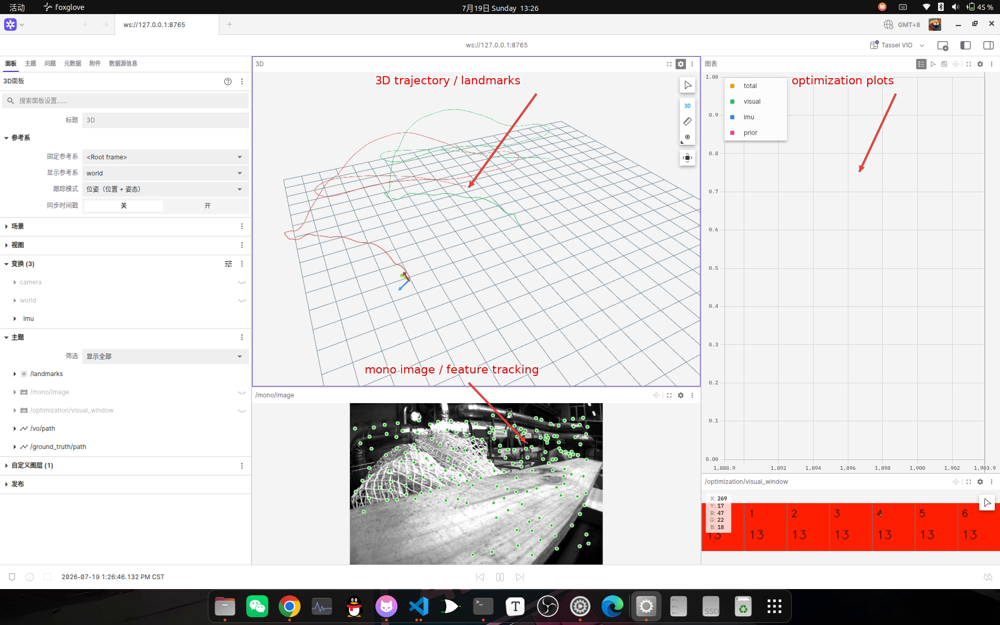

# Tassel 可视化器

Tassel 可视化器通过 ROS 2 和 Foxglove 展示 VIO 的图像、轨迹、路标和优化状态。

## 功能

- 发布单目特征跟踪图、优化轨迹、IMU 里程计和路标点云。
- 发布优化代价、视觉因子数量等后端诊断信息。
- 自动启动 `foxglove_bridge`，安装 Tassel 可视化布局并打开 Foxglove Studio。

## 环境要求

- ROS 2 和 `foxglove_bridge`。
- Foxglove Studio。
- Python 3 和 `PyYAML`。

启动前加载 ROS 2 环境：

```bash
source /opt/ros/$ROS_DISTRO/setup.bash
```

可视化器使用 `config/foxglove.yaml` 配置桥接端口、话题白名单和布局路径。

## 启动可视化器

在 Tassel 根目录执行：

```bash
python3 -m tassel_tools.viewer.foxglove config/foxglove.yaml
```

常用选项：

- `--no-bridge`：只安装布局并打开 Foxglove，不启动桥接。
- `--no-studio`：只启动桥接，不自动打开 Foxglove Studio。
- `--generate-only`：只生成并安装布局，不启动桥接和界面。
- `python3 -m tassel_tools.viewer.foxglove --help`：查看完整帮助。

默认桥接地址为：

```text
ws://127.0.0.1:8765
```

## 可视化配置

- `bridge.port`：Foxglove WebSocket 桥接端口，默认 `8765`。
- `bridge.address`：桥接服务监听地址，默认仅监听本机 `127.0.0.1`。
- `bridge.topic_whitelist`：允许转发到 Foxglove 的 ROS 2 话题列表。
- `studio.executable`：Foxglove Studio 可执行文件路径。
- `studio.layout_file`：Tassel Foxglove 布局文件路径。
- `studio.layout_name`：布局在 Foxglove 中显示的名称。
- `viewer.path_max_poses`：可视化器发布的轨迹最多保留的位姿数量。

## 发布话题



图中箭头对应的可视化区域：

- `3D trajectory`：`/vio/path`、`/slam/path`、`/slam/keyframe_path`、
  `/ground_truth/path` 和 `/vio/odometry`。
- `mono image / feature tracking`：`/mono/image`。
- `visual factors`：`/optimization/visual_window` 中各窗口槽的视觉因子数量。
- `loop matches`：`/loop/matches` 最终通过 PnP 的 BRIEF 匹配图。

- `/mono/image`：左目单目特征跟踪图。
- `/vio/odometry`：局部连续且不包含回环修正的视觉惯性里程计。
- `/vio/path`：局部视觉惯性轨迹。
- `/ground_truth/path`：数据集真值轨迹（如果存在）。
- `/optimization/visual_window`：彩色分段显示各窗口槽的视觉因子数量。
- `/loop/matches`：当前关键帧与最终通过 PnP 的候选 BRIEF 匹配图。
- `/slam/keyframe_path`：GTSAM 优化后的全局关键帧轨迹。
- `/slam/path`：按全局关键帧修正重建的全局稠密轨迹。

## 回环候选演示

先用不参与测试的序列训练 BRIEF 词典：

```bash
./build/tassel_loop/train_brief_vocabulary \
  "$HOME/.local/share/tassel/brief.dbow3" 400 \
  datasets/machine_hall/MH_02_easy \
  datasets/machine_hall/MH_03_medium \
  datasets/machine_hall/MH_04_difficult \
  datasets/machine_hall/MH_05_difficult
```

再将词典作为第五个可选参数传给 EuRoC 驱动：

```bash
./build/tassel_core/test_euroc \
  config/euroc.yaml datasets/machine_hall/MH_01_easy 0 20 \
  "$HOME/.local/share/tassel/brief.dbow3"
```

词典必须由 BRIEF 描述子训练，不能直接替换为 ORB 词典。候选先经过时间后验或高分候选
回退门控，再由宿主相机系深度路标执行 PnP RANSAC。通过验证的六自由度相对位姿作为鲁棒
`BetweenFactor<Pose3>` 写入 GTSAM。全局结果用于重建输出轨迹，不修改 VIO 滑窗和边缘化先验。
